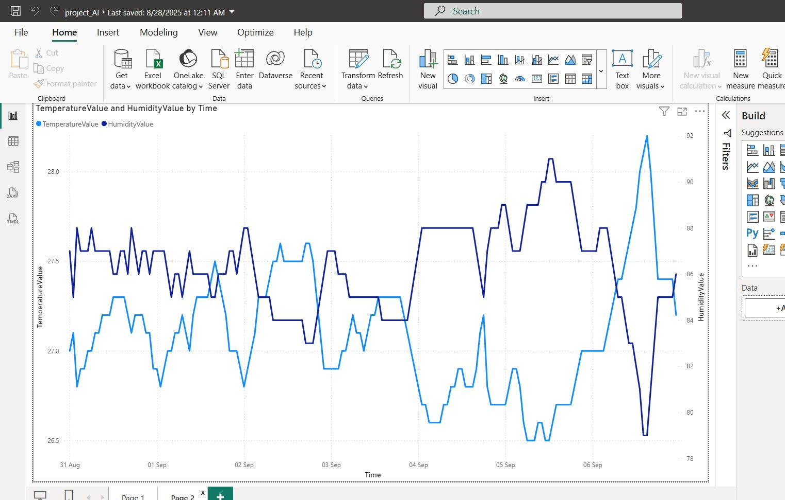
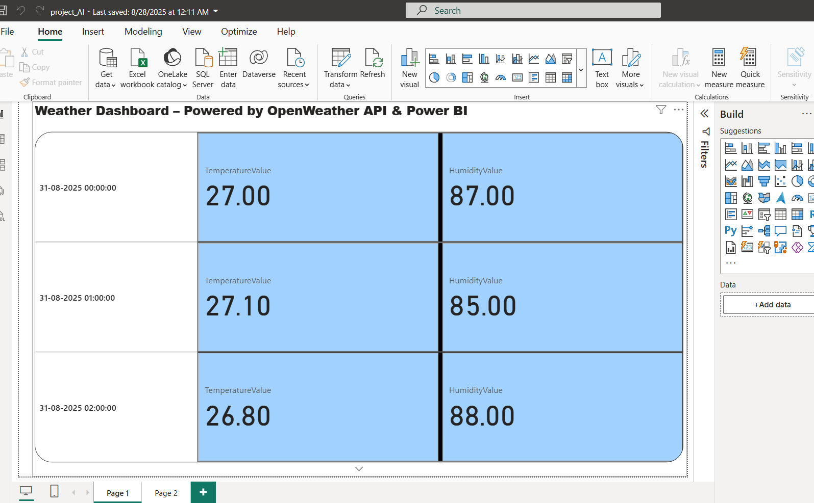

# Weather Dashboard (Power BI + OpenWeather API)

## 📊 Project Overview
This project connects Power BI to the OpenWeather free API 
to fetch real-time hourly weather data (Temperature & Humidity).
The dashboard provides:
- Hourly Temperature & Humidity line chart
- Current weather KPIs
- Daily min/max values
- Date slicer for filtering

## 🛠️ Tech Used
- Power BI
- OpenWeather API (free, no credit card)
- Power Query (M Language)

## 🚀 How to Run
1. Clone this repo
2. Open `WeatherDashboardProject_AI.pbix` in Power BI Desktop
3. Replace the API key with your own in Power Query (`Source` step)
4. Refresh → see live data

## 📷 Screenshots

